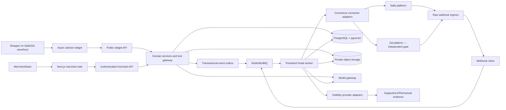
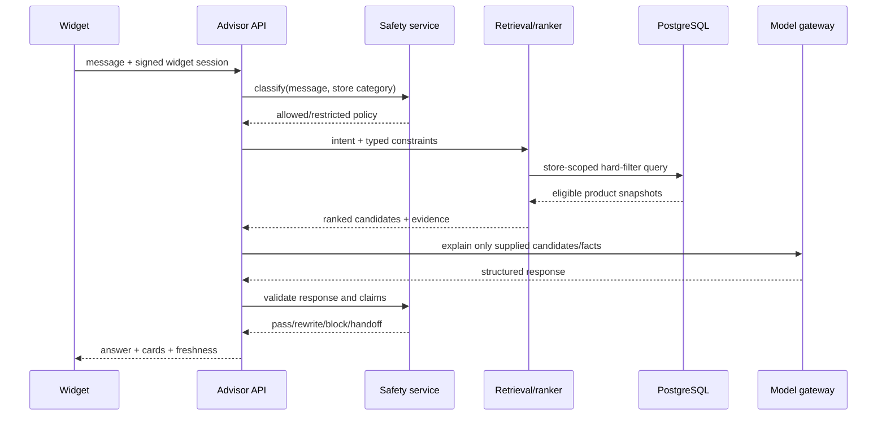

# بصيرة — Technical Architecture

**Status:** Target architecture with an explicitly limited demo foundation

**Last updated:** 2026-07-13

## 1. Scope and current state

This document is normative for the production target. It does not assert that the target is implemented.

### Present in the repository

- Next.js 16, React 19, strict TypeScript, Tailwind CSS, shadcn/ui, Zod, TanStack Query, Drizzle tooling, PostgreSQL/Redis client libraries, BullMQ, and AI SDK dependencies.
- Normalized commerce types and a shared connector interface.
- A partially implemented Salla adapter: Easy Mode install URL, Custom Mode token exchange/refresh, webhook HMAC verification, and a strict authorization-event parser. Live store/resource mapping remains unavailable until fixtures are contract-tested.
- A partially implemented Zid adapter: authorization URL construction and dual-token exchange/refresh. Resource/header-family mapping and webhook handling remain feature-gated pending development-store fixtures.
- An in-memory demo repository with seeded Arabic store data and idempotent demo events.
- Deterministic recommendation filtering/ranking, category safety classification, and content-readiness scoring.
- Arabic marketing/setup/dashboard/widget UI routes backed by the demo repository, plus demo advisor, event, conversation, merchant-tool, and OAuth-state routes.
- A broad Drizzle PostgreSQL schema definition covering identity, tenancy, integrations, catalog, commerce, conversations, actions, visibility, billing, events, and audit. It is a schema foundation, not evidence of an applied migration or production data path.

### Not yet proven for production

Authentication, persistent tenant repositories/RLS, applied database migrations, queue workers, object storage, real OAuth installation, full sync, storefront script installation, live analytics, order reconciliation, real provider visibility checks, merchant actions, billing, and operational controls.

## 2. Architectural decisions

| Decision | Choice | Reason |
| --- | --- | --- |
| Application boundary | Next.js App Router web/API plus a separate Node worker | One language and validation layer for the MVP; long-running sync and webhook work must not run inside request lifetimes. |
| Database | PostgreSQL with Drizzle | Matches the repository, supports explicit SQL/constraints, tenant keys, JSONB evidence, and pgvector without hiding query behavior. |
| Queue | Redis + BullMQ | Durable retries, delayed reconciliation, concurrency control, and dead-letter handling. The worker requires a persistent runtime. |
| Storage | S3-compatible private object storage | Signed access for knowledge files, raw evidence, sanitized exports, and audit artifacts. |
| Analytics | PostgreSQL initially; append-only event contract | Keeps the first slice simple while allowing high-volume event copies to move to ClickHouse later. |
| AI | Model/provider abstraction plus typed tools | Separates product selection and metric computation from natural-language explanation. |
| Search | SQL hard filters → lexical/vector retrieval → optional reranker | Safety, stock, price, and tenant constraints remain deterministic. |
| Localization | `next-intl`, locale-aware server routing, logical CSS | Arabic RTL and English LTR share components without mirrored business semantics. |
| Integration strategy | Anti-corruption adapters around normalized models | Platform payload changes stay inside Salla/Zid packages. |

Start as a modular monolith. Extract a service only after load, security boundary, or independent deployment pressure is measured.

## 3. System view



### Trust boundaries

1. Storefront traffic is untrusted, rate-limited, origin-bound, and cannot access merchant APIs.
2. Merchant sessions are authenticated and every query is authorized for one `store_id`.
3. Platform webhooks are untrusted until verified over the raw request and deduplicated.
4. Model output is untrusted until schema validation, policy validation, and provenance checks pass.
5. Uploaded documents are untrusted until type/size checks, quarantine scan, text extraction, and tenant binding complete.

## 4. Proposed repository structure

Existing files should move incrementally; this is the target, not a demand for a rewrite.

```text
src/
  app/
    [locale]/
      (marketing)/             # landing, pricing, demo
      (auth)/                  # sign-in, invite, workspace creation
      (onboarding)/            # connection, sync, onboarding, test/publish
      (merchant)/              # overview and module screens
    api/v1/
      auth/                    # session and invitation endpoints
      oauth/{platform}/        # start/callback where the platform mode supports it
      webhooks/{platform}/     # raw, fast, verified ingress
      widget/                  # bootstrap, messages, events, handoff
      stores/                  # merchant-scoped resources
      visibility/              # query/check/report resources
      actions/                 # draft, approve, publish, rollback
  components/
    ui/                        # accessible primitives
    merchant/                  # product-specific merchant patterns
    widget/                    # isolated storefront UI
    charts/                    # decision-oriented chart wrappers
  config/                      # validated environment and feature flags
  core/
    auth/                      # sessions, memberships, authorization policies
    commerce/
      connector.ts             # normalized contract
      types.ts                 # platform-neutral models
      salla/                   # transport, schemas, mapping, fixtures
      zid/                     # transport, schemas, mapping, fixtures
    db/
      schema/                  # Drizzle tables grouped by domain
      migrations/
      queries/                 # tenant-scoped query modules
    events/                    # envelope, registry, outbox, consumers
    jobs/                      # BullMQ definitions and retry policies
    observability/             # logs, traces, metrics, redaction
    storage/                   # private object and signed URL boundary
  modules/
    advisor/                   # intent, constraints, retrieval, ranking, explanation
    conversations/             # messages, signals, handoff
    intelligence/              # merchant analytics tools and insights
    attribution/               # identity/window/reconciliation logic
    content/                   # audits, drafts, approval, publication
    visibility/                # readiness plus observed evidence
    safety/                    # pre-classifier, policies, post-validator
    billing/                   # entitlements and usage; platform-specific adapters
  workers/
    index.ts                   # persistent worker entry point
    processors/                # sync, webhook, embeddings, audits, visibility, actions
  test/
    fixtures/{salla,zid}/      # redacted official sandbox payloads
    contract/                  # connector mapping tests
    integration/               # DB/queue/tenant tests
    e2e/                       # merchant and storefront paths
```

## 5. Request and data-flow rules

### Catalog sync

1. Create a `sync_jobs` record and enqueue a fast-sync job.
2. Connector fetches one page using a credential snapshot; rate limit and cursor/page state are persisted.
3. Zod validates the raw response. The adapter maps it to normalized records with external ID, external update time, mapping version, and raw-evidence reference.
4. A transaction upserts products, variants, categories, attributes, and sync checkpoint.
5. Product changes enqueue embedding/readiness jobs through the outbox.
6. Background order/customer sync starts independently; onboarding is not blocked by history.
7. A nightly reconciliation compares platform counts/checkpoints and repairs missed webhooks.

Do not hold a database transaction while calling a platform API or a model.

### Webhook pipeline

`receive raw bytes → verify source → derive provider delivery/idempotency key → insert webhook inbox row → return 2xx → enqueue → validate/map → update domain data → append events/outbox → record outcome`

- Unique key: `(platform, external_store_id, provider_event_id)` when available; otherwise a versioned hash of stable envelope fields plus raw-body digest.
- A duplicate returns success without duplicating effects.
- Retry only retryable failures with exponential backoff and jitter.
- Poison messages enter a dead-letter state with a safe replay control.
- Raw payload retention is short, encrypted, access-controlled, and redacted from normal logs.

### Customer recommendation



The model never receives authority to fetch arbitrary tenant data or select a product outside the candidate list.

### Store mutation

Draft generation and publication are separate commands. Publication requires:

- authorized role and recent session;
- approved draft and immutable source-fact snapshot;
- allow-listed field/risk class;
- `expectedSourceVersion` conflict check;
- unique idempotency key;
- pre-publish policy/claim validation;
- before/after version and audit entry;
- adapter capability reported as verified in the current release.

## 6. Internal API surface

All payloads use versioned Zod schemas. Merchant routes derive `store_id` from an authorized membership, never from a trusted request body. The following routes are **production targets** unless present in source.

### Public/storefront

| Method | Route | Purpose |
| --- | --- | --- |
| `GET` | `/api/v1/widget/bootstrap` | Exchange an origin-bound install ID for short-lived widget configuration/session |
| `POST` | `/api/v1/widget/conversations` | Start a consent-aware anonymous conversation |
| `POST` | `/api/v1/widget/conversations/{id}/messages` | Run safety, retrieval, explanation, and persistence |
| `POST` | `/api/v1/widget/events` | Batch versioned commerce/advisor events with idempotency keys |
| `POST` | `/api/v1/widget/handoffs` | Create a consented handoff request |

### Authentication and connections

| Method | Route | Purpose |
| --- | --- | --- |
| `POST` | `/api/v1/workspaces` | Create workspace and owner membership |
| `POST` | `/api/v1/stores` | Create a pending store connection |
| `POST` | `/api/v1/oauth/{platform}/start` | Create signed state and start the supported flow |
| `GET/POST` | `/api/v1/oauth/{platform}/callback` | Validate callback only where official mode requires it |
| `POST` | `/api/v1/webhooks/{platform}` | Raw platform ingress; handler differs by provider |
| `POST` | `/api/v1/stores/{storeId}/disconnect` | Revoke/erase tokens and disable widget/jobs safely |
| `GET` | `/api/v1/stores/{storeId}/sync` | Sync status and checkpoints |
| `POST` | `/api/v1/stores/{storeId}/sync/retry` | Retry a failed/retriable segment |

### Merchant resources

| Method | Route | Purpose |
| --- | --- | --- |
| `GET` | `/api/v1/stores/{storeId}/overview` | Freshness-aware overview aggregates |
| `GET` | `/api/v1/stores/{storeId}/products` | Product performance and audit list |
| `GET` | `/api/v1/stores/{storeId}/products/{id}` | Facts, performance, conversations, audits, versions |
| `GET` | `/api/v1/stores/{storeId}/conversations` | Filtered, cursor-paginated list |
| `GET` | `/api/v1/stores/{storeId}/conversations/{id}` | Redacted transcript, signals, events, attribution |
| `POST` | `/api/v1/stores/{storeId}/advisor/messages` | Merchant tool-orchestrated analysis |
| `GET/POST` | `/api/v1/stores/{storeId}/opportunities` | Ranked opportunities and status changes |
| `POST` | `/api/v1/stores/{storeId}/drafts` | Create a source-bound content draft |
| `POST` | `/api/v1/stores/{storeId}/drafts/{id}/approve` | Record approval; does not imply publication |
| `POST` | `/api/v1/stores/{storeId}/drafts/{id}/publish` | Queue a verified connector mutation |
| `POST` | `/api/v1/stores/{storeId}/actions/{id}/rollback` | Queue supported rollback from stored version |

### AI visibility

| Method | Route | Purpose |
| --- | --- | --- |
| `GET` | `/api/v1/stores/{storeId}/visibility/readiness` | Versioned technical/content readiness checks |
| `GET/POST` | `/api/v1/stores/{storeId}/visibility/queries` | Manage localized monitored queries |
| `POST` | `/api/v1/stores/{storeId}/visibility/queries/{id}/checks` | Queue supported or manual check workflow |
| `GET` | `/api/v1/stores/{storeId}/visibility/checks` | Observations with method/capability/confidence |
| `GET/POST` | `/api/v1/stores/{storeId}/visibility/competitors` | Merchant-controlled competitor entities |
| `GET` | `/api/v1/stores/{storeId}/visibility/citations` | Reviewed citation evidence |
| `GET` | `/api/v1/stores/{storeId}/visibility/reports/{id}` | Immutable methodology-versioned report |

## 7. Commerce connector boundary

`CommercePlatformConnector` is the anti-corruption layer. Application modules use `UnifiedStore`, `UnifiedProduct`, `UnifiedOrder`, and related models only.

### Connector requirements

- Transport client with timeouts, provider rate-limit handling, retry classification, correlation IDs, and token refresh lock.
- Zod schema per external response/event version.
- Pure mapping functions with redacted sandbox fixtures and snapshot/contract tests.
- Capability report that distinguishes documented, sandbox-verified, unavailable, and temporarily degraded.
- Stable pagination/checkpoint implementation per resource; do not pretend all providers use cursors.
- Provenance on every normalized record.
- Explicit `not_supported` or `pending_verification`; never return plausible fake data.

### Adapter implementations

- **Salla:** first production adapter. Current custom OAuth/token and signature code is a foundation only. Marketplace authorization mode, scopes, payload mappings, storefront snippet, billing, and review must pass the checklist in `INTEGRATIONS.md`.
- **Zid:** target adapter behind a disabled feature flag until OAuth/header conventions, fixtures, webhook authentication, storefront installation, cart operations, billing, and review requirements are sandbox-proven.
- **Mock Salla:** demo-only adapter/repository; production configuration must not silently fall back to it.

## 8. Agent and AI service architecture

Agents are orchestrators over typed, permission-scoped tools—not independent sources of truth.

| Service | May do | Must not do |
| --- | --- | --- |
| CustomerAdvisorAgent | Detect intent/constraints, request catalog retrieval, explain candidates, answer verified policies, trigger handoff | Invent products/facts; query other tenants; bypass safety or hard filters |
| MerchantIntelligenceAgent | Select read-only analytics tools, compare periods, summarize evidence, create proposed opportunities | Query arbitrary SQL; state inference as fact; mutate the store |
| ContentOptimizationAgent | Audit source content, create bilingual drafts/diffs, attach evidence and risk class | Publish; add unsupported claims; alter high-risk fields |
| AIVisibilityAgent | Run readiness rules, supported provider tools, entity/citation matching, gap analysis | Fabricate provider output; scrape against terms; blend readiness with observed presence |
| SafetyAgent | Pre-classify risk, select category policy, validate claims, rewrite/block/handoff | Provide diagnosis or unsupported health/compatibility advice |

### Merchant tool contract

Each tool declares input schema, required permission, tenant scope, data-freshness field, query version, cost class, timeout, and output provenance. Read tools include store summary, sales trend, conversation metrics, intents, objections, product/recommendation funnel, assisted revenue, unanswered questions, content gaps, visibility evidence, and page readiness. Write tools create drafts only; connector mutation is a separate approved command.

### Model gateway

- Task aliases (`fast-classifier`, `customer-explainer`, `merchant-reasoner`, `embedding`, `reranker`) map to configured providers/models.
- Structured output is mandatory for classifiers, extractors, tool selection, and drafts.
- Prompts are versioned; request logs store hashes, latency, tokens, cost, safety result, and evidence IDs—not hidden chain-of-thought.
- Budgets exist per store, plan, task, and request. Circuit breakers degrade to deterministic/helpful states.
- Evaluation sets include Arabic dialects, English, prompt injection, empty evidence, stale stock, and sensitive categories.

## 9. Event system

### Canonical envelope

```text
event_id              UUID generated at ingestion
event_type            Versioned registry name
event_version         Integer schema version
store_id              Required tenant key
session_id            Pseudonymous storefront session when applicable
visitor_id            Rotatable pseudonymous ID when consent permits
customer_id           Nullable internal customer reference
conversation_id       Nullable
product_id/variant_id Nullable
occurred_at            Client/platform event time
received_at            Server time
source                 widget | storefront | platform | merchant | system
consent_state          essential | analytics | marketing | unknown
idempotency_key        Source-scoped unique key
metadata               Validated, size-limited JSON
```

### Registry

`widget_loaded`, `chat_opened`, `conversation_started`, `message_sent`, `intent_detected`, `recommendation_shown`, `product_clicked`, `product_viewed`, `product_compared`, `product_added_to_cart`, `checkout_started`, `purchase_completed`, `conversation_abandoned`, `human_handoff_requested`, `ai_answer_failed`, `visibility_check_started`, `visibility_check_completed`, `content_draft_created`, `content_change_approved`, and `content_change_published`.

Every breaking payload change increments `event_version`. Server timestamps and platform order reconciliation are authoritative for attribution; client events alone do not prove a purchase.

### Transactional publication

Domain writes and an `event_outbox` record occur in one database transaction. A dispatcher publishes pending rows to queues/analytics, then marks them delivered. Consumers are idempotent and maintain their own processed-event key.

## 10. Database entity map

This map mirrors the broad Drizzle schema foundation in `src/db/schema.ts` and the production target. It does **not** imply that a migration has been applied or that the current UI/API uses PostgreSQL; the working demo still uses process memory.

```mermaid
erDiagram
    ORGANIZATIONS ||--o{ ORGANIZATION_MEMBERS : has
    USERS ||--o{ ORGANIZATION_MEMBERS : joins
    ORGANIZATIONS ||--o{ STORES : owns
    USERS ||--o{ STORE_MEMBERS : receives
    STORES ||--o{ STORE_MEMBERS : authorizes
    STORES ||--o{ PLATFORM_CONNECTIONS : connects
    PLATFORM_CONNECTIONS ||--o{ CONNECTION_CAPABILITIES : reports
    PLATFORM_CONNECTIONS ||--o{ WEBHOOK_REGISTRATIONS : subscribes
    STORES ||--o{ SYNC_JOBS : runs
    SYNC_JOBS ||--o{ SYNC_CHECKPOINTS : checkpoints
    SYNC_JOBS ||--o{ SYNC_ERRORS : records
    STORES ||--o{ PRODUCTS : contains
    PRODUCTS ||--o{ PRODUCT_TRANSLATIONS : localizes
    PRODUCTS ||--o{ PRODUCT_MEDIA : displays
    PRODUCTS ||--o{ PRODUCT_VARIANTS : has
    PRODUCTS ||--o{ PRODUCT_CATEGORIES : classified_by
    CATEGORIES ||--o{ PRODUCT_CATEGORIES : groups
    PRODUCTS ||--o{ PRODUCT_ATTRIBUTES : describes
    PRODUCTS ||--o{ PRODUCT_DOCUMENTS : supported_by
    DOCUMENTS ||--o{ PRODUCT_DOCUMENTS : supports
    DOCUMENTS ||--o{ DOCUMENT_CHUNKS : chunks
    STORES ||--o{ STORE_POLICIES : publishes
    STORES ||--o{ CUSTOMERS : knows
    STORES ||--o{ VISITORS : pseudonymizes
    VISITORS ||--o{ WIDGET_SESSIONS : starts
    STORES ||--o{ ORDERS : receives
    ORDERS ||--o{ ORDER_ITEMS : contains
    PRODUCTS ||--o{ ORDER_ITEMS : purchased_as
    STORES ||--o{ CARTS : observes
    CARTS ||--o{ CART_ITEMS : contains
    STORES ||--o{ CONVERSATIONS : hosts
    CONVERSATIONS ||--o{ MESSAGES : contains
    CONVERSATIONS ||--o{ CONVERSATION_SIGNALS : yields
    CONVERSATIONS ||--o{ RECOMMENDATIONS : shows
    RECOMMENDATIONS ||--o{ RECOMMENDATION_ITEMS : contains
    RECOMMENDATIONS ||--o{ RECOMMENDATION_EVENTS : receives
    STORES ||--o{ COMMERCE_EVENTS : records
    ORDERS ||--o{ ORDER_ATTRIBUTIONS : attributed
    CONVERSATIONS ||--o{ HUMAN_HANDOFFS : escalates
    CONVERSATIONS ||--o{ SAFETY_INTERVENTIONS : protects
    STORES ||--o{ OPPORTUNITIES : discovers
    OPPORTUNITIES ||--o{ OPPORTUNITY_TARGETS : affects
    OPPORTUNITIES ||--o{ OPPORTUNITY_ACTIONS : tracks
    OPPORTUNITIES ||--o{ CONTENT_DRAFTS : proposes
    CONTENT_DRAFTS ||--o{ CONTENT_VERSIONS : versions
    CONTENT_DRAFTS ||--o{ CONTENT_APPROVALS : approves
    CONTENT_DRAFTS ||--o{ PUBLICATION_RUNS : publishes
    STORES ||--o{ AI_VISIBILITY_QUERIES : monitors
    AI_VISIBILITY_QUERIES ||--o{ AI_VISIBILITY_CHECKS : sampled_by
    AI_VISIBILITY_CHECKS ||--o{ AI_VISIBILITY_MENTIONS : finds
    AI_VISIBILITY_CHECKS ||--o{ AI_VISIBILITY_CITATIONS : cites
    STORES ||--o{ AI_VISIBILITY_COMPETITORS : compares
    STORES ||--o{ AI_VISIBILITY_SCORES : audits
    AI_VISIBILITY_SCORES ||--o{ AI_VISIBILITY_SCORE_COMPONENTS : explains
    STORES ||--o{ PAGE_AUDITS : audits
    PRODUCTS ||--o{ PRODUCT_AUDITS : audits
    PAGE_AUDITS ||--o{ AUDIT_FINDINGS : finds
    STORES ||--o{ PLANS : configures
    PLANS ||--o{ ENTITLEMENTS : grants
    STORES ||--o{ SUBSCRIPTIONS : entitles
    STORES ||--o{ USAGE_RECORDS : meters
    STORES ||--o{ AUDIT_LOGS : secures
```



### Entity groups and invariants

| Group | Tables | Key invariants |
| --- | --- | --- |
| Identity/tenancy | `users`, `accounts`, `auth_sessions`, `organizations`, `organization_members`, `stores`, `store_members` | Unique membership; server-side RBAC; store is the primary data boundary |
| Integration/jobs | `oauth_states`, `platform_connections`, `connection_capabilities`, `webhook_registrations`, `sync_jobs`, `sync_checkpoints`, `sync_errors`, `job_runs`, `webhook_events`, `outbox_events` | Encrypted tokens; unique external store/platform; idempotent webhook key; stateful checkpoints/outbox |
| Catalog/knowledge | `products`, `product_translations`, `product_media`, `product_variants`, `categories`, `product_categories`, `product_attributes`, `documents`, `product_documents`, `document_chunks`, `store_policies` | Unique `(store_id, platform, external_id)`; money in minor units; provenance/version; verified fact source |
| Commerce/identity | `customers`, `visitors`, `widget_sessions`, `orders`, `order_items`, `carts`, `cart_items`, `attribution_rules`, `order_attributions`, `commerce_events`, `daily_store_metrics`, `daily_product_metrics` | No raw payment data; external identity encrypted/pseudonymized where possible; reconciled order state |
| Conversations/safety | `conversations`, `messages`, `conversation_signals`, `recommendations`, `recommendation_items`, `recommendation_events`, `human_handoffs`, `safety_interventions` | Retention/consent; immutable shown-product snapshot; redaction and safety audit |
| Merchant intelligence/actions | `store_pages`, `merchant_threads`, `merchant_messages`, `merchant_tool_runs`, `merchant_insights`, `opportunities`, `opportunity_targets`, `opportunity_actions`, `content_drafts`, `content_versions`, `content_approvals`, `publication_runs` | Evidence IDs, confidence, status machine, approval actor, expected source version, mutation result |
| Visibility/audits | `ai_visibility_competitors`, `ai_visibility_queries`, `ai_visibility_checks`, `ai_visibility_mentions`, `ai_visibility_citations`, `ai_visibility_scores`, `ai_visibility_score_components`, `page_audits`, `product_audits`, `audit_findings` | Readiness separated from observed check; method/capability/country/language/time; scoring methodology version |
| Commercial/governance | `plans`, `entitlements`, `subscriptions`, `usage_records`, `audit_logs` | Entitlement source, append-only usage/audit, idempotency, immutable actor/action/resource metadata |

Every tenant-owned table carries a non-null `store_id` even when derivable through a parent. Composite foreign keys include `store_id` where practical to prevent cross-tenant associations. Row-level security is defense in depth; application queries still require an explicit tenant context.

### Data types and indexing

- Currency: integer minor units plus ISO currency; never binary floating point.
- Time: `timestamptz`, stored UTC; render in store timezone.
- External IDs: text plus platform; do not coerce all IDs to integers.
- Evidence/raw JSON: size-bounded JSONB with a schema/mapping version; large raw artifacts go to object storage.
- Vectors: separate embeddings with model, dimension, source version, and store ID; vector queries also filter tenant/status before ranking.
- High-value indexes: tenant + external ID, tenant + occurred time, conversation/product funnels, open opportunity status, visibility query/check time, webhook idempotency, pending outbox/job state.

## 11. Attribution architecture

Attribution is a reproducible query, not a mutable flag.

1. Persist recommendation impression with product/variant snapshot and session identity basis.
2. Persist click/cart events with source and consent.
3. Import/reconcile the platform order and items.
4. Match only permitted identities and same-store events.
5. Evaluate the configured direct and influenced windows with a versioned attribution rule.
6. Store an attribution result containing evidence event IDs, rule version, confidence/reconciliation status, and calculated time.

An event can be `unmatched`, `provisional`, `reconciled`, or `invalidated`. Dashboards default to reconciled results and display provisional values separately.

## 12. Operational architecture

### Queue families

- `sync.fast`, `sync.history`, `sync.reconcile`
- `webhook.process`
- `knowledge.scan`, `knowledge.extract`, `knowledge.embed`
- `audit.product`, `audit.page`, `audit.store`
- `conversation.signals`, `analytics.aggregate`
- `visibility.check`, `visibility.review`
- `content.generate`, `content.publish`, `content.rollback`
- `privacy.export`, `privacy.delete`

Each family defines concurrency, timeout, retry classes, backoff, per-store/provider rate limit, dead-letter behavior, and an operator-visible run record.

### Observability

- Correlation IDs across route, job, connector request, model call, and audit event.
- Structured redacted logs with store ID hash and operation—not access tokens or raw customer messages by default.
- Metrics: request/error/latency, queue depth/age/failure, token refresh, platform rate limit, webhook verification/delay, sync lag, model latency/cost/schema failures, safety intervention, provider health, and action conflicts.
- Alerts target customer impact: stopped webhooks, stale catalog, growing dead-letter queue, elevated unsafe-output rejection, or unexpected cost.

### Failure behavior

- Stale catalog: disclose freshness, disable add-to-cart/recommendation when availability exceeds the safe threshold, and trigger sync.
- Model unavailable: preserve deterministic policy/FAQ paths where possible; never invent a fallback answer.
- Queue unavailable: accept only operations that can be durably written to an outbox; otherwise return a retriable state.
- Provider monitoring unavailable: retain last observation with timestamp and show the new check as unavailable, not zero visibility.
- Connector mutation conflict: do not overwrite; create a review task with the current platform version.

## 13. Architecture acceptance gates

The production label requires evidence for:

- migration and rollback rehearsal;
- tenant isolation/RBAC integration tests;
- raw webhook signature/authentication and duplicate/replay tests;
- token refresh race and revocation tests;
- redacted Salla sandbox mapping fixtures for every used field;
- queue restart, retry, dead-letter, and reconciliation tests;
- Arabic/English recommendation and safety evaluation thresholds;
- storefront performance/consent/mobile tests;
- attribution reconciliation fixtures;
- readiness methodology versioning and observed-visibility separation;
- auditability and optimistic concurrency for every store action;
- security, privacy, and legal review without claiming certification or statutory compliance.
