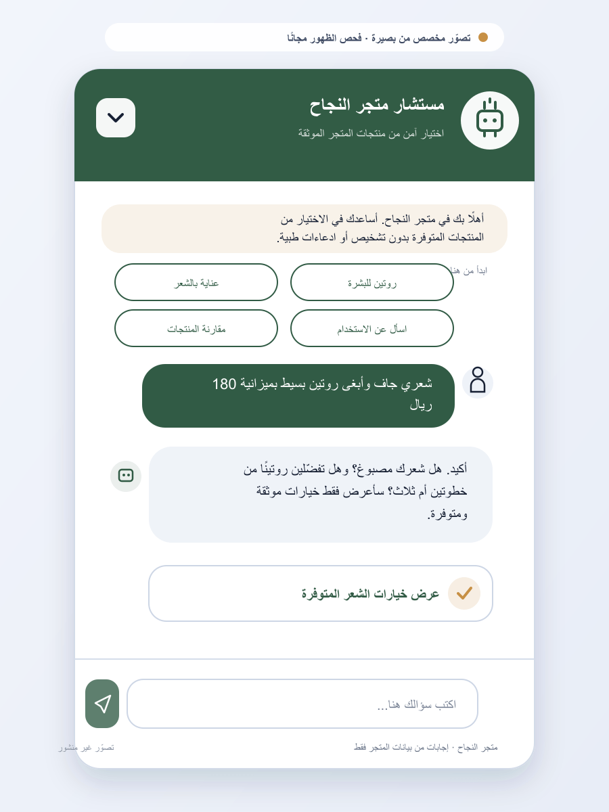
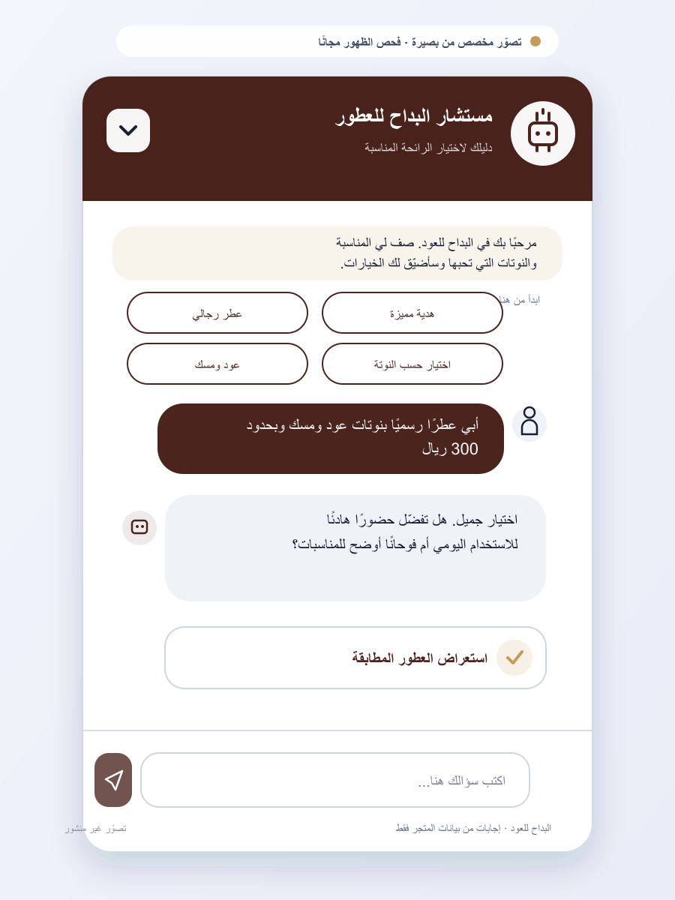
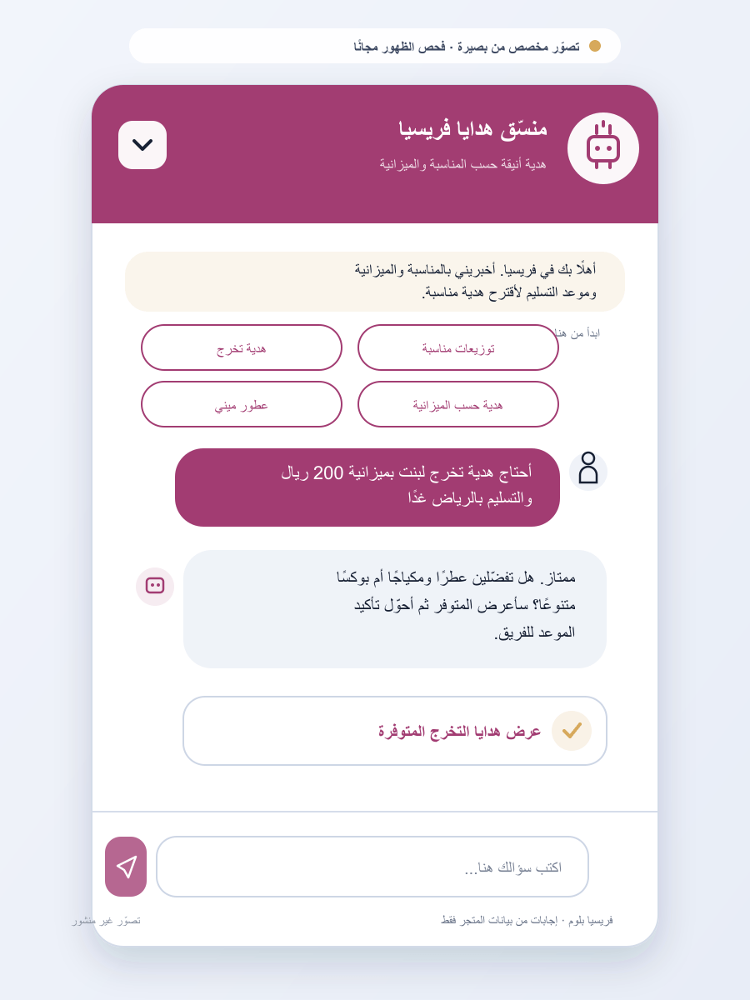
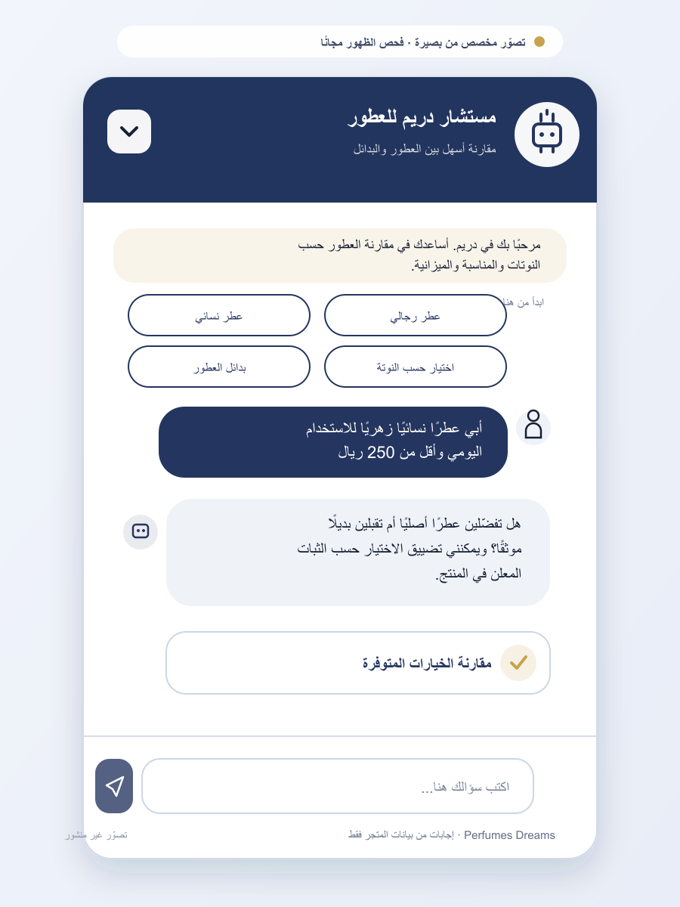
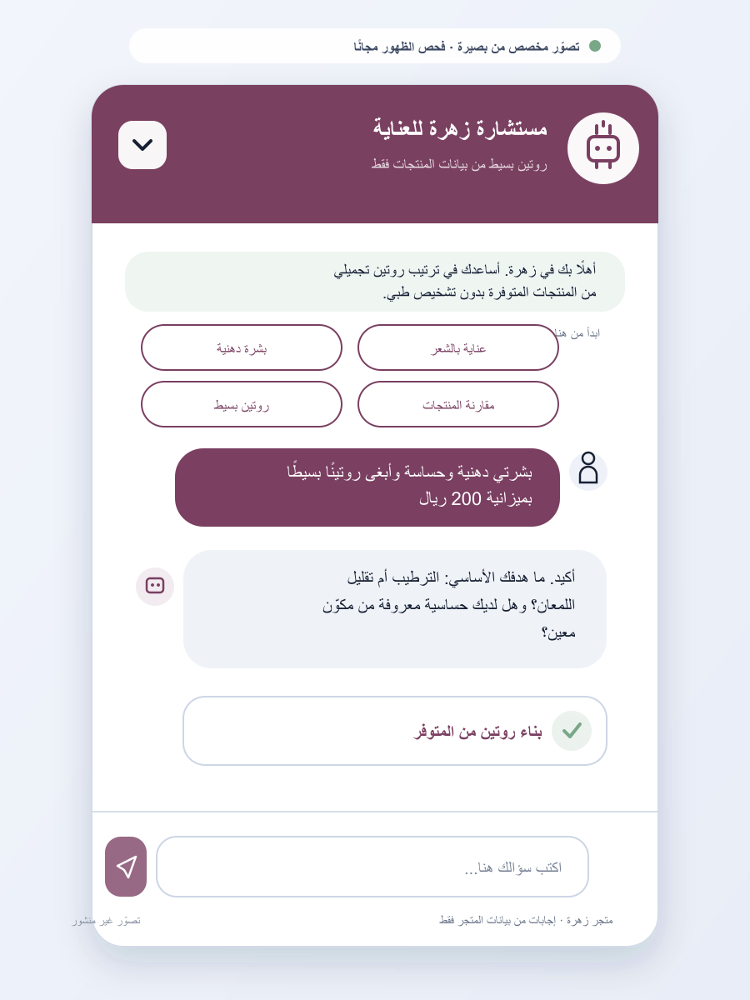

# Basirah client prospect report

**Prepared:** 14 July 2026  
**Market:** Saudi Arabia  
**Motion:** Founder-led B2B sales to active Salla merchants  
**Research method:** Public business websites and public business contact routes only. No private contact data, login-gated sources, or bulk scraping.

## Executive answer

Basirah's best first clients are Saudi Salla stores where customers need help choosing between many products. The strongest starting categories are skincare and beauty, perfume and oud, wellness, and gifts. These merchants have three problems Basirah already addresses:

1. Customers ask repetitive, high-intent questions before buying.
2. Merchants have enough products that manual recommendations and content maintenance become difficult.
3. Product facts, FAQs, and brand content need to be clearer for Google and AI answer systems.

The recommended buyer is the **owner/founder** in a small store, or the **e-commerce, growth, customer-experience, or digital marketing manager** in a larger retailer.

The recommended first contact offer is a **free AI-visibility check and evidence report** for the merchant's public store. The report should show what search crawlers and AI answer systems can access and understand, the most important content or technical gaps, and the next practical fixes. It must not promise ranking, ChatGPT mentions, citations, or sales.

## Ideal client profile

> An active Saudi Salla merchant selling 50–500+ products in a choice-heavy category, serving Arabic-speaking shoppers, with visible customer questions or many product variants, an accessible owner or commerce team, and a reason to improve conversion, support efficiency, or AI-search readiness now.

### Pass/fail checklist

- [ ] Live Salla store with a public business contact route
- [ ] Saudi or Saudi-focused Arabic commerce operation
- [ ] Product choice requires advice about need, preference, budget, use case, or occasion
- [ ] Enough catalog depth for recommendations to matter
- [ ] Current campaign, catalog expansion, content gap, or technical visibility issue provides a timely outreach angle
- [ ] Product data can support grounded recommendations without inventing facts

### Disqualifiers

- Store is closed, under maintenance, or has no public contact route
- Catalog is too small for a product advisor to add meaningful value
- Merchant expects guaranteed ranking or guaranteed sales results
- Product claims cannot be handled safely from verified catalog facts
- Merchant already has an equivalent grounded Arabic advisor and conversation-intelligence workflow

## Prioritized lead sheet

| Score | Company | Category | Why it fits | Timely signal | Public contact route | Confidence | Verified |
| --- | --- | --- | --- | --- | --- | --- | --- |
| Hot | [Aṭṭārat Al-Najah](https://al-ngah.com/) | Natural wellness, beauty, hair and skincare | The store reports 350 products, 12,687 customers, and 12,890 sales. A large, advice-heavy catalog creates a strong recommendation and FAQ use case. | The homepage contains health/weight-related customer language, making grounded answers and safety controls especially valuable. Its declared sitemap returned 404 in the research snapshot. | [WhatsApp](https://wa.me/966554944710) · 055 494 4710 | High | 2026-07-14 |
| Warm | [Albdah Oud](https://albdah.com/ar/) | Oud, perfume, musk, hair fragrance and gifts | Multiple fragrance families, physical branches, online sales, blog content, and a brand operating since 1989 indicate meaningful scale and a clear scent-discovery use case. | The homepage promotes many collections and reports 98% five-star satisfaction. Its fetched homepage contained 16 H1 elements, giving Basirah a specific content-structure audit angle. | [Instagram](https://www.instagram.com/Albadah_oud) · 9200 31535 | High | 2026-07-14 |
| Warm | [Freesia Bloom](https://freesiabloom.com/) | Perfume minis, makeup, gifts and event favors | The store serves personal use, gifts, events, brands, budgets, and immediate delivery—ideal inputs for a conversational gift finder. | Active Eid 2026 messaging and broad gift categories show campaign activity. The sitemap on the public domain pointed to `freesia-de.com`, not the canonical `freesiabloom.com` domain. | [WhatsApp](https://wa.me/966503443669) · 050 344 3669 | High | 2026-07-14 |
| Warm | [Perfumes Dreams](https://perfumesdreams.com/) | Global perfume brands, alternatives, oud and incense | The broad taxonomy—women, men, unisex, alternatives, oils, incense, and brands—creates high choice friction that a preference-and-budget advisor can reduce. | The store advertises 24-hour support, suggesting real presale questions. Its declared sitemap returned 404, and no homepage FAQ section was detected in the public HTML snapshot. | [WhatsApp](https://wa.me/966542010090) · 054 201 0090 | High | 2026-07-14 |
| Warm | [Zahraa](https://zahraa-sa.com/) | Skincare, haircare, body care and makeup | Customers need routine, concern, hair type, and budget guidance across several categories. This closely matches Basirah's existing beauty demonstration. | The homepage still exposed offers dated January 2026 in the July snapshot, contained 9 H1 elements, and did not expose a homepage FAQ section in fetched HTML—useful content-freshness and structure talking points. | [WhatsApp](https://api.whatsapp.com/send?phone=+966115622229) | High | 2026-07-14 |

**Scoring note:** “Hot” means strong fit plus a clear, current outreach reason and reachable business contact. “Warm” means strong fit with a softer buying signal. Store-reported customer, sales, and satisfaction numbers are not independently audited and must be described as self-reported.

## Free AI-visibility report offer

Give every prospect a short report before asking for a meeting. The free report should include:

- whether the public storefront and important discovery files respond correctly;
- whether the store identity, category, products, policies, and trust facts are explicit;
- whether high-intent customer questions can be answered from public verified content;
- visible content freshness, heading, canonical, FAQ, sitemap, and structured-data observations;
- the three highest-priority fixes with source evidence;
- a clear limitation statement: readiness is not proof of current ranking, mentions, or citations.

The findings below are **public-site previews**, not completed numerical Basirah scans. Run Basirah's real checker and preserve its evidence URL before sending a scored report.

## Account report 1 — Aṭṭārat Al-Najah

### Why approach first

This is the clearest Basirah fit. The store publicly presents a large catalog and substantial order history, while selling products that trigger detailed questions about skin, hair, weight, use, and expected outcomes. Those questions create both conversion opportunity and safety risk.

### Observed opportunity

- 350 products across several advice-heavy categories
- 12,687 customers and 12,890 sales shown by the store
- Public WhatsApp makes the owner or store operator reachable
- Homepage has an Organization schema object, but the sitemap URL declared in `robots.txt` returned 404 during this snapshot
- No FAQ section was detected in the homepage HTML snapshot

### Best Basirah wedge

Lead with a **free AI-visibility report**, using the broken sitemap response and missing homepage FAQ as the first evidence. Then offer a **safe Arabic product advisor pilot** for one category, such as skincare or haircare. Restrict answers to verified product facts and route medical, weight-loss, pregnancy, allergy, or diagnosis questions to human support.

### Personalized bot concept

### Suggested opening message

> السلام عليكم، جهزت لكم فحص ظهور مجاني لمتجر النجاح يوضح ما تستطيع محركات البحث وأنظمة الذكاء الاصطناعي الوصول إليه وفهمه، مع ملاحظة واضحة في خريطة الموقع وفرص FAQ. لاحظت أيضًا أن عندكم أكثر من 350 منتجًا في فئات تحتاج أسئلة كثيرة قبل الشراء. بعد التقرير أقدر أجهز تجربة محدودة لـ«بصيرة»: مستشار عربي يرشّح من المخزون الفعلي فقط، مع إيقاف الادعاءات الطبية وتحويل الأسئلة الحساسة لفريقكم.

### Discovery questions

1. ما أكثر ثلاثة أسئلة تصل للواتساب قبل الطلب؟
2. أي قسم لديه زيارات أو استفسارات كثيرة لكن تحويل أقل؟
3. من يراجع معلومات الاستخدام والتحذيرات قبل نشرها؟

## Account report 2 — Albdah Oud

### Why approach

Albdah has maturity, brand history, branches, and a broad catalog. The sales problem is not basic trust; it is helping an online shopper describe a preferred scent and reach the right product without smelling it in person.

### Observed opportunity

- Saudi perfume and oud company operating since 1989
- Multiple collections for men, women, children, hair, musk, oud, and gifts
- Blog and FAQ links show an existing content investment that Basirah can extend rather than replace
- Public phone and official social profiles provide business contact routes
- Homepage snapshot contained 16 H1 elements, suggesting a focused page-structure review is worthwhile

### Best Basirah wedge

Open with a **free AI-visibility report** focused on content structure, entity clarity, and answerable fragrance questions. Then pitch a **digital scent concierge**: ask occasion, preferred notes, intensity, budget, and recipient; recommend only in-stock products; then summarize the unanswered questions the content team should address.

### Personalized bot concept

### Suggested opening message

> السلام عليكم، جهزت للبداح فحص ظهور مجاني يوضح كيف تفهم محركات البحث وأنظمة الإجابة محتوى العلامة والعطور، مع فرص عملية في بنية الصفحة والأسئلة القابلة للإجابة. عندكم تنوع كبير يصعب اختياره أونلاين بدون تجربة الرائحة، لذلك أرفقت أيضًا تصورًا لـ«مستشار البداح للعطور» يسأل عن المناسبة والنوتات والميزانية ثم يرشّح فقط من المتوفر. إذا ناسبكم التقرير نقترح تجربة على مجموعة واحدة.

### Discovery questions

1. ما نسبة أسئلة “أي عطر يناسبني؟” في الواتساب والفروع؟
2. هل توصيف النوتات موحّد وقابل للاستخدام عبر الكتالوج؟
3. أي مجموعة تريدون زيادة اكتشافها دون الاعتماد على الخصم؟

## Account report 3 — Freesia Bloom

### Why approach

Freesia sells decisions, not just items: gift type, recipient, occasion, brand, budget, quantity, and delivery date. This is a natural conversational-shopping flow.

### Observed opportunity

- Many categories across perfume minis, makeup, branded bags, gifts, favors, and electronics
- Current Eid 2026 and immediate-delivery messaging shows active merchandising
- Public WhatsApp is clearly used for fulfillment questions
- Public sitemap index referenced another domain, `freesia-de.com`, while the canonical storefront was `freesiabloom.com`

### Best Basirah wedge

Lead with a **free AI-visibility report** that documents the sitemap-domain mismatch and content freshness opportunities. Then launch an **occasion-and-budget gift finder** before the next campaign. The assistant can recommend combinations and hand off quantity, delivery-date, or custom-event questions to WhatsApp.

### Personalized bot concept

### Suggested opening message

> السلام عليكم، جهزت لفريسيا فحص ظهور مجاني، ووجدت تعارضًا واضحًا بين نطاق المتجر والنطاق الموجود في خريطة الموقع. التقرير يشرح الأثر والخطوة المقترحة بدون أي وعود بالترتيب. وبما أن خياراتكم تتغير حسب المناسبة والميزانية والبراند، أرفقت تصورًا لمنسّق هدايا عربي يرشّح من المتوفر ويحوّل الكميات أو تأكيد التسليم السريع للواتساب.

### Discovery questions

1. ما أكثر مناسبة تولّد أسئلة قبل الشراء؟
2. هل طلبات الكميات والتوزيعات تحتاج تسعيرًا أو موافقة بشرية؟
3. ما آخر موعد يجب أن يصل فيه الطلب قبل أن يتوقف المساعد عن اقتراحه؟

## Account report 4 — Perfumes Dreams

### Why approach

The store carries many perfume types, brands, alternatives, oils, and incense. The combination of broad selection and advertised 24-hour support indicates recurring presale decision questions.

### Observed opportunity

- Wide category and brand coverage
- Public WhatsApp contact and 24-hour support claim
- Declared sitemap returned 404 in the research snapshot
- Homepage HTML exposed Organization schema, but no homepage FAQ section was detected

### Best Basirah wedge

Start with a **free AI-visibility report** highlighting the broken sitemap response and missing homepage FAQ opportunity. Then offer a **fragrance comparison assistant** that answers questions such as original versus alternative, note family, occasion, longevity information when verified, and price range—without making unsupported quality or performance claims.

### Personalized bot concept

### Suggested opening message

> السلام عليكم، جهزت لدريم فحص ظهور مجاني ووجدت ملاحظة تقنية واضحة في خريطة الموقع وفرصة لتحويل أسئلة المقارنة إلى FAQ موثق. التقرير يشرح الأدلة والإصلاحات المقترحة. أرفقت أيضًا تصورًا لمستشار عطور عربي يفلتر حسب النوتات والمناسبة والميزانية ويعرض المنتج المتوفر فقط، ثم يجمع المقارنات والاعتراضات المتكررة لفريقكم.

### Discovery questions

1. ما أكثر البراندات أو البدائل التي يقارن بينها العملاء؟
2. ما المعلومات التي يمكن اعتمادها رسميًا عن الثبات والتركيز؟
3. كم سؤال دعم متكرر يمكن تحويله إلى إجابة موثقة داخل المتجر؟

## Account report 5 — Zahraa

### Why approach

Zahraa matches the existing Basirah beauty demo closely. Shoppers can be guided by skin concern, hair type, routine step, preferred brand, and budget.

### Observed opportunity

- Skincare, haircare, body care, and makeup categories
- Public WhatsApp contact route
- Homepage promotions dated January 2026 were still present in the July 2026 snapshot
- Homepage snapshot contained 9 H1 elements and did not expose a visible FAQ section in fetched HTML

### Best Basirah wedge

Lead with a **free AI-visibility and content-freshness report**, including the old promotion dates, heading structure, and homepage FAQ opportunity. Then offer a **routine builder** limited to cosmetic guidance, with strict rules against diagnosis or medical advice.

### Personalized bot concept

### Suggested opening message

> السلام عليكم، جهزت لمتجر زهرة فحص ظهور مجاني يتضمن ملاحظات على حداثة العروض وبنية العناوين وفرص FAQ، مع خطوات إصلاح واضحة وبدون وعود ترتيب. أرفقت أيضًا تصورًا لمستشارة عناية تساعد العميل حسب نوع البشرة أو الشعر والميزانية من بيانات المتجر فقط، وتمنع التشخيص والادعاءات الطبية. إذا ناسبكم التقرير نبدأ بتجربة على فئة واحدة.

### Discovery questions

1. هل معلومات نوع البشرة أو الشعر والاستخدام مكتملة في بيانات المنتجات؟
2. ما أكثر روتين يطلبه العملاء في المحادثات؟
3. من المسؤول عن إزالة العروض المنتهية وتحديث المحتوى؟

## Where to find more clients

1. **Salla App Store:** This should become the main scalable inbound channel after security, privacy, marketplace approval, and a real development-store test are complete.
2. **Manual Salla-store discovery:** Search Google for category terms plus the current Salla footer phrase, then qualify stores individually. Example: `"صنع بإتقان على | 2026 منصة سلة" "العناية بالبشرة"`.
3. **Mahally product and store pages:** Use individual public listings to identify active merchants and then contact the merchant through its own published business channel.
4. **Instagram and TikTok:** Target Saudi brands posting current campaigns, new collections, product comparisons, or “which one?” content. Contact only through the published business account or store link.
5. **Saudi retail and e-commerce events:** Attend as a founder with a live Arabic demo and a one-page audit offer. Prioritize merchant operators and e-commerce managers, not generic technology buyers.
6. **Salla agencies and service partners:** One agency serving several stores can become a distribution partner after the first 3–5 direct merchant pilots prove the workflow.

## Recommended first offer

Do not lead with the entire platform. Use a two-step offer:

> **Step 1 — Free AI-visibility check and report:** scan the public store, preserve evidence, explain the top three gaps, and provide fixes. No card, no installation, and no ranking or mention guarantee.

If the merchant finds the report useful, continue with:

> **Step 2 — 14-day Basirah category pilot:** connect one product category, configure 5–8 shopper questions, test grounded recommendations, review safety handoffs, and deliver a report of top questions, objections, content gaps, and AI-search readiness issues.

Measure only observable pilot outcomes:

- advisor opens and completed conversations
- product-card clicks from recommendations
- handoffs to WhatsApp or support
- unsupported questions the catalog could not answer
- content gaps identified and approved by the merchant

Do not promise rankings, mentions in AI systems, or a sales uplift before measured evidence exists.

## Outreach order

1. Aṭṭārat Al-Najah — strongest immediate pain and accessible owner/operator channel
2. Freesia Bloom — highly demonstrable gift-finder use case and current campaign activity
3. Perfumes Dreams — strong catalog-choice problem plus a clear technical audit hook
4. Zahraa — easiest match to the existing beauty demo
5. Albdah Oud — highest strategic value, but likely a longer and more formal sale

## Open verification items before outreach

- Confirm that each public phone or WhatsApp route still reaches the business.
- Do not guess a personal email or employee name; ask who owns e-commerce or customer experience.
- Run Basirah's full public checker and save the evidence URL before presenting any numerical readiness score.
- Verify product-catalog size for every store except Al-Najah; the report currently uses visible category breadth, not a claimed SKU total.
- Treat merchant-displayed sales, customer, return, and satisfaction figures as self-reported.

## Skill discovery note

The installed `prospecting` skill was the best-fit research foundation. This completed workflow has also been packaged as a reusable personal Codex skill at `~/.codex/skills/find-future-clients`. Invoke `$find-future-clients` when you want a new evidence-backed client list, free AI-visibility report previews, personalized outreach, and store-specific bot mockups. The public skills directory also surfaced `founder-sales` (2.0K installs) as an optional next skill once prospects move into meetings and closing.
